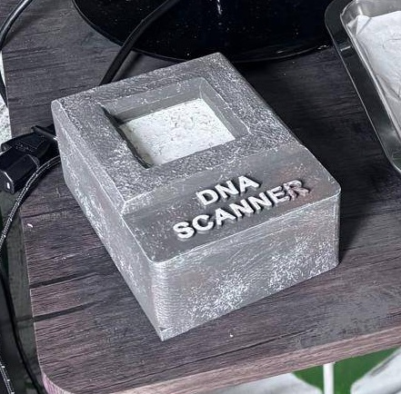
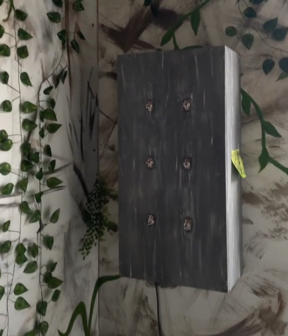

## Jurassic Park Booth - Arduino Code
This repo contains the code behind the three Arduinos used in our 2025 Spring Carnival attraction. See the [DinoGame](github.com/p0nk0/DinoGame) repo for more context.

## Overview
Each Arduino controlled a different hardware component and communicated with Unity Via serial.
 
## Arduinos
| Folder | Name | Role | Author | Libraries Needed | Arduino Type |
|---|---|---|---|---|---|
| `/RFID` | DNA Scanner | Reads RFID tags | Taylor Roberts | MFRC522, SPI | MKR Zero |
| `/PuzzleBox` | Circuit Breaker Puzzle | Reads switch inputs | Taylor Roberts | | Uno |
| `/dino_control` | Animatronic | Controlls dinosaur animatronic movements | Matthew Saenz | ServoEasing, MedianFilterLib | Mega |

## Setup
- See `/Libraries` for the needed non-standard libraries
- For proper communication with Unity, make sure each SerialControllers object matches each board's respective baud rate.

## Media
DNA Scanner 

Circuit Breaker Puzzle

Animatronic Dinosaur

